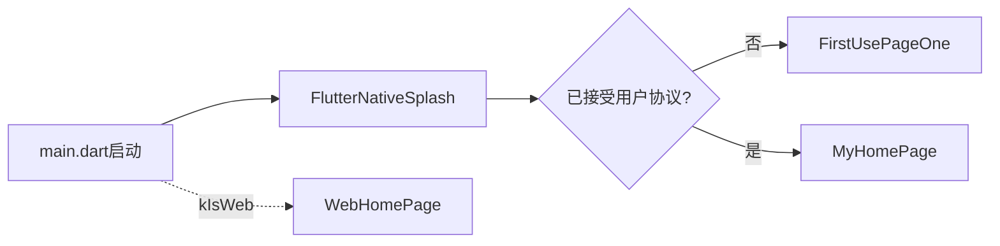
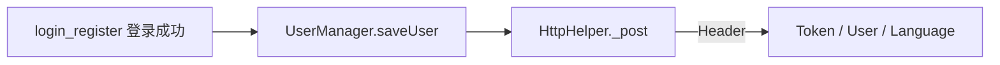

# Abiya Translator（translator-app）交接文档

本文档面向 **Flutter移动端**接手人，目标是在约 **1～2 个工作日** 内完成环境搭建、本地调试、理解主业务流，并掌握发版与常见问题排查入口。  
**敏感口令、密钥本体** 请放在团队密码管理器中；正文只写职责、位置与轮换流程。

---

## 1. 项目一句话

| 项 | 说明 |
|----|------|
| 产品 | 多语言翻译客户端（中文、蒙古文、英文、日文等），见 `pubspec.yaml` 中 `description`。 |
| 技术栈 | **Flutter**，Dart SDK `>=3.3.4 <4.0.0`。 |
| 包名 | `abiya_translator`（`pubspec.yaml` 的 `name`）。 |
| 当前版本 | `pubspec.yaml`：`version: 1.0.5+25`（随发版更新）。 |

---

## 2. 仓库与模块边界

- **本仓库**：仅 **App 客户端**（`translator-app`）。
- **相关仓库**：后台/运营若使用同工作区下的 `translator-app-admin`（Vue 管理端），职责边界为：**配置与运营数据走 admin；App 只通过 HTTP API 与后端交互**，勿在 App 内写死应由后台下发的业务规则（除非历史原因已存在）。

---

## 3. 环境与本地运行

### 3.1 必备工具

- Flutter（与 `pubspec.yaml` 中 `environment.sdk` 兼容的版本，建议与上一任或团队约定版本一致）。
- **Android**：Android Studio、Android SDK；`minSdkVersion` 29、`targetSdkVersion` 36（见 `android/app/build.gradle`）。
- **iOS**：Xcode、CocoaPods（按 Flutter 官方文档）。
- **JDK**：注意 `pubspec.yaml` 中 **`sqflite_android` 的 `dependency_overrides`**：固定为 `2.4.1`，注释说明为避免更高版本依赖 **Java 19+** API；构建机 JDK 需与团队约定（常见为 11 或 17，以实际能编过为准）。

### 3.2 常用命令

```bash
cd translator-app
flutter pub get
flutter run
```

按需指定设备：`flutter devices` 后使用 `-d <device_id>`。

### 3.3 联调后端（重要）

- **API 根地址** 在 `lib/api/apis.dart` 的 `host` 常量。当前生产为 `https://abiya-tech.com/api/app`。
- 同文件内有多行 **已注释** 的本地/内网地址（`localhost`、`10.0.2.2`、局域网 IP 等）。
- **交接约定建议**：联调时临时改 `host`，**禁止将个人内网地址提交入库**；长期方案可改为 flavor / `--dart-define`（若后续改造）。

---

## 4. 配置与密钥（敏感信息清单）

### 4.1 API 与 H5 协议页

| 用途 | 位置 | 当前值（以代码为准，发版前请再确认） |
|------|------|--------------------------------------|
| REST API 前缀 | `lib/api/apis.dart` → `host` | `https://abiya-tech.com/api/app` |
| 协议/会员等 H5 基址 | `lib/utils/constants.dart` → `baseUrl` | `https://abiya-tech.com/app` |
| 隐私政策 / 用户协议 / 会员协议 | `constants.dart` 拼接路径 | `privacy_statement`、`user_agreement`、`membership_agreement` |

**负责人占位**：域名、HTTPS证书、WAF —— _________

### 4.2 微信 SDK（wechat_kit）

配置在 **`pubspec.yaml`** 顶层 `wechat_kit:` 段（非 `dependencies` 内）：

- `app_id`
- `universal_link`（需与 iOS Associated Domains、服务端校验一致）

**负责人占位**：微信开放平台应用、Universal Link 域名与 **`apple-app-site-association`** 维护 —— _________

### 4.3 支付宝（tobias）

配置在 **`pubspec.yaml`** 顶层 `tobias:` 段：

- `url_scheme`
- iOS：`universal_link`、`ignore_security` 等

**负责人占位**：支付宝开放平台、商户号、密钥轮换 —— _________

### 4.4 应用内购买（IAP）

- Flutter 依赖：`in_app_purchase`（见 `pubspec.yaml`）。
- 服务端相关路径常量（`lib/api/apis.dart`）：`apiStartIapTransaction`、`apiVerifyIosTransaction`、`apiVerifyGoogleTransaction` 等；微信/支付宝另有 `start_*` / `verify_*` 常量。

**负责人占位**：App Store Connect / Google Play 控制台、服务端订单校验 —— _________

---

## 5. 架构与代码地图

### 5.1 入口与全局单例

- **`lib/main.dart`**：`WidgetsFlutterBinding`、启动屏 `FlutterNativeSplash`、`GetIt` 注册：
  - `UserManager`（用户与会话相关本地状态）
  - `LanguageSetting`、`SystemSetting`（语言与主题等）
- **首启/协议**：`UserManager.userAgreementAccepted()` 为 false 时进入 `FirstUsePageOne`，否则 `MyHomePage`；**Web** 使用 `WebHomePage`（`kIsWeb`）。

### 5.2 网络层

- **`lib/api/http_helper.dart`**：`Dio` POST、超时（`connectTimeout` 5s、`receiveTimeout` 10s）、失败重试；请求头携带 `Token`、`User`、`Language`（见 `_post`）。
- **`lib/api/apis.dart`**：`*host*` 与路径常量（见第 6 节表）。
- **`lib/api/responses.dart`**：通用响应解析基类。

**认证说明**：登录成功后 `UserInfo.token` 持久化在 `SharedPreferences`（`UserManager.saveUser`），后续请求头 `Token` 取自 `GetIt.I<UserManager>().getCurrentUser()`。**未发现独立 refresh 接口时**，token 失效行为以后端约定为准（需在联调文档或本节补充）。

### 5.3 本地数据

- **`lib/db/db_helper.dart`**、`history_model.dart`：**SQLite（sqflite）** 历史等。
- **`lib/db/user_manager.dart`**：`USER`、`FIRST_USE`、最近交易 UUID/ID 等键；`UserInfo` JSON 序列化字段含 `uuid`、`token`、`expire_date`（映射为 `membershipExpireDate`）等。

### 5.4 业务页面与模块（`lib/`）

| 目录/文件 | 职责摘要 |
|-----------|----------|
| `pages/home.dart`、`pages/home_web.dart` | 主界面（移动端 / Web） |
| `pages/translation_list_page.dart` | 翻译列表 |
| `pages/phrasebook.dart` | 短语 |
| `pages/membership.dart` | 会员与支付流程（含 IAP/三方支付调用） |
| `pages/personal.dart`、`pages/user_info_page.dart` | 个人中心与资料 |
| `pages/setting_page.dart`、`pages/theme_setting.dart` | 设置与主题 |
| `pages/message_list_page.dart`、`pages/faq.dart`、`pages/feedback.dart` | 消息、FAQ、反馈 |
| `pages/transactions.dart` | 交易记录 |
| `pages/profession_selection_page.dart` | 职业选择 |
| `pages/web_view.dart` | 内嵌网页（含部分 Header） |
| `login_register/*` | 登录、注册、邮箱验证、首启引导 |
| `utils/pay/*` | 微信 / 支付宝 / IAP 封装 |
| `widgets/*` | 通用 UI 组件 |

### 5.5 国际化（l10n）

- **`l10n.yaml`**：`arb-dir: lib/l10n`，模板 `app_en.arb`，生成 `app_localizations.dart`。
- **ARB 文件**：`lib/l10n/app_en.arb`、`app_zh.arb`、`app_ja.arb`、`app_mn.arb`、`app_mo.arb`。
- **流程**：修改 arb → 运行 `flutter gen-l10n`（或依赖 IDE/构建自动生成）→ 使用 `AppLocalizations.of(context)!`。
- **`main.dart`** 中 `supportedLocales`：`en`、`ja`、`zh`、`mn`、`mo`。

### 5.6 路由说明

- 未统一使用命名路由框架；**根导航**由 `MaterialApp` 的 `home` 在 `main.dart` 中根据 `kIsWeb` / `firstUse` 分支；子页面多为 **`Navigator.push`** 进入（具体见各 `pages`、`login_register`）。

---

## 6. 核心用户路径（流程图）

### 6.1 启动 → 协议 → 首页



### 6.2 登录后调用 API



### 6.3 会员 / 支付（示意）

会员详情实现集中在 **`pages/membership.dart`**，并与 **`lib/utils/pay/`**、**`apis.dart`** 中 `apiStart*` / `apiVerify*` 配合；具体分支（微信 / 支付宝 / IAP）以代码为准。

---

## 7. 接口路径常量一览（`lib/api/apis.dart`）

所有路径均拼接在 **`host`** 之后（例如 `host + apiLogin`）。

| 常量名 | 路径 |
|--------|------|
| `apiCheckEmail` | `/app/check_email` |
| `apiGetVerificationCode` | `/app/get_verification_code` |
| `apiVerifyCode` | `/app/verify_code` |
| `apiRegister` | `/app/register` |
| `apiChangePassword` | `/app/change_password` |
| `apiFogotPassword` | `/app/forgot_password` |
| `apiLogin` | `/app/login` |
| `apiTranslate` | `/app/translate` |
| `apiAddFavourite` | `/app/add_favourite` |
| `apiDeleteTranslateHistory` | `/app/delete_history` |
| `apiHistoryList` | `/app/get_history` |
| `apiClearHistory` | `/app/clear_history` |
| `apiGetLanguageList` | `/app/get_languages` |
| `apiGetPhraseCategories` | `/app/get_phrase_categories` |
| `apiFeedback` | `/app/feedback` |
| `apiGetFeedbackTypes` | `/app/get_feedback_types` |
| `apigetPhraseList` | `/app/get_phrases` |
| `apiGetMessageList` | `/app/get_messages` |
| `apigetFaqList` | `/app/get_faq_list` |
| `apiGetTransactions` | `/app/get_transactions` |
| `apiVerifyIosTransaction` | `/app/verify_ios_transaction` |
| `apiVerifyGoogleTransaction` | `/app/verify_google_transaction` |
| `apiStartIapTransaction` | `/app/start_iap_transaction` |
| `apiTransaction` | `/app/get_last_transaction` |
| `apiStartWechatTransaction` | `/app/start_wechat_transaction` |
| `apiRegisterDevice` | `/app/register_device` |
| `apiDeleteAccount` | `/app/delete_account` |
| `apiGetSubscriptionProducts` | `/app/get_subscription_products` |
| `apiVerifyWechatTransaction` | `/app/verify_wechat_purchase` |
| `apiStartAlipayTransaction` | `/app/start_alipay_transaction` |
| `apiVerifyAlipayTransaction` | `/app/verify_alipay_purchase` |
| `apiGetProfessionList` | `/app/get_professions` |
| `apiSetUserProfession` | `/app/set_profession` |

**说明**：`apiBaiduTranslate` 为百度翻译域名常量 `api.fanyi.baidu.com`，用法需结合业务代码；若后端已统一代理，以实际调用为准。

---

## 8. 构建、签名与发版

### 8.1 Android

| 项 | 值/位置 |
|----|---------|
| `applicationId` / `namespace` | `com.abiya.translator`（`android/app/build.gradle`） |
| 签名配置 | `android/app/build.gradle` → `defaultConfig.signingConfigs.release` |
| Keystore 文件 | `android/app/abiya_trans_app_keystore`（需纳入团队安全备份，**勿丢失**） |
| `keyAlias` | `abiya_translator` |

**安全提醒**：若仓库中曾提交 keystore 口令明文，**强烈建议**轮换 keystore 口令，并改为从环境变量或 CI 密钥库注入，避免写入版本库。

**发版前检查（Android）**：

- [ ] `pubspec.yaml` 中 `version` 与商店版本号策略一致。
- [ ] `flutter build appbundle`（或 `apk`）使用预期签名。
- [ ] 在真机验证登录、翻译、支付（若本期有改动）。

### 8.2 iOS

| 项 | 值/位置 |
|----|---------|
| `PRODUCT_BUNDLE_IDENTIFIER` | `com.abiya.translator`（`ios/Runner.xcodeproj/project.pbxproj`） |
| 显示名 | `Abiya Translator`（`ios/Runner/Info.plist`） |
| 版本 | `FLUTTER_BUILD_NAME` / `FLUTTER_BUILD_NUMBER`（由 Flutter 构建注入） |

**发版前检查（iOS）**：

- [ ] Associated Domains 与微信/支付宝 Universal Link 一致（若使用）。
- [ ] IAP、支付相关 Capability与 App ID 配置一致。
- [ ] Archive 分发前在 TestFlight 冒烟：登录、翻译、会员。

### 8.3 CI

- 根目录存在 **`codemagic.yaml`**（Codemagic）；若团队启用，请补充：触发分支、环境变量/密钥注入方式、产物归档位置。
- 当前仓库 **未发现** `.github/workflows` 等 GitHub Actions 配置；若另有 Jenkins等，请在本节补充链接与触发规则。**无自动化时按手工发版** 记录。

---

## 9. 已知问题与技术债（接手人请持续更新）

| 编号 | 现象/主题 | 说明 | Workaround |
|------|-----------|------|------------|
| T1 | 多环境 `host` | `apis.dart` 中大量注释掉的本地地址，易误提交 | 联调改 `host` 后提交前 diff 检查；长期改用 `dart-define` |
| T2 | `sqflite_android` 锁定 | `dependency_overrides` 固定 `2.4.1` 以避免 Java 19+ | 升级前评估 Android 构建 JDK 版本 |
| T3 | 日志仅 Debug | `Logger.log` 仅在 `kReleaseMode == false` 时 `print` | 线上问题需依赖用户描述、`adb`/Xcode 或后续接入远程日志 |
| T4 | Token 刷新 | 代码侧为登录后存 token，未见显式 refresh | 与后端确认过期策略与错误码，必要时在 `HttpHelper` 统一处理 |
| T5 | Android 签名机密 | 签名信息写在 `build.gradle` 存在泄露风险 | 迁移至安全存储并轮换 |

（以上为根据当前代码归纳；**请删除不适用项并补充真实 bug 单链接/群公告**。）

---

## 10. 运维与排障

### 10.1 日志

- **`lib/utils/logger.dart`**：仅在 **Debug** 模式输出 `print`；Release 包默认无统一文件日志。
- **Android**：`adb logcat` 过滤应用包名或 Dart/Flutter 相关 tag。
- **iOS**：Xcode **Devices and Simulators** 或 Console.app。

### 10.2 网络问题

- **超时**：`HttpHelper` 内 `connectTimeout` 5 秒、`receiveTimeout` 10 秒。
- **失败回调**：业务通过 `onError(errCode, errMsg)` 处理；`errCode != 0` 时见 `CommonReponse`（`responses.dart`）。

### 10.3 常见问题入口

- 接口地址错误：查 `apis.dart` 的 `host`。
- 协议页空白：查 `constants.dart` 的 `baseUrl` 与路径。
- 支付调起失败：查 `pubspec.yaml` 微信/支付宝配置与 iOS URL Types / Universal Link。

---

## 11. 仓库目录与文件说明

本节按 **仓库根目录 →平台工程 → `lib/` 源码** 列出职责，便于接手人快速定位。**不展开**本地生成或工具缓存目录（如 `.dart_tool/`、`build/`、`android/.gradle/`、`android/app/.cxx/`、`macos/Flutter/ephemeral/` 等）；这些目录随构建产生，勿手工改、勿依赖其入库状态。

### 11.1 仓库根目录（文件）

| 路径 | 说明 |
|------|------|
| `pubspec.yaml` | Flutter 包名、版本号、依赖、`assets`/`fonts` 声明，以及 **wechat_kit / tobias** 等原生插件顶层配置。 |
| `pubspec.lock` | 依赖版本锁文件；协作时应提交，保证 `flutter pub get` 结果一致。 |
| `analysis_options.yaml` | Dart 分析器与 `flutter_lints` 规则配置。 |
| `l10n.yaml` | `flutter gen-l10n` 配置（ARB 目录、模板文件等）。 |
| `README.md` | 项目简述（若有；详细交接以本文档为准）。 |
| `.gitignore` | Git 忽略规则（构建产物、IDE、密钥等）。 |
| `.metadata` | Flutter 项目元数据（模板/通道信息）。 |
| `.fvmrc` | [FVM](https://fvm.app) 等工具锁定的 Flutter SDK 版本（若团队使用 FVM，以该文件为准对齐本机 Flutter）。 |
| `flutter_launcher_icons.yaml` | 应用图标生成配置（`flutter_launcher_icons`）。 |
| `flutter_native_splash.yaml` | 启动屏资源与样式配置（与 `main.dart` 中 `FlutterNativeSplash` 配合）。 |
| `devtools_options.yaml` | Dart DevTools 相关选项（可选）。 |
| `codemagic.yaml` | [Codemagic](https://codemagic.io) CI/CD 流水线定义（若启用；触发分支、证书与密钥注入方式需团队另行文档化）。 |
| `.flutter-plugins-dependencies` | 由 `flutter pub get` 生成的插件依赖索引（可提交或按团队约定忽略）。 |

### 11.2 仓库根目录（文件夹）

| 路径 | 说明 |
|------|------|
| `lib/` | **主业务与 UI 源码**（Dart），见下文 **11.5 节**。 |
| `assets/` | 静态资源根目录：`images/`、`images/icons/`（见 `pubspec.yaml`）、`fonts/`（如 NotoSans 蒙古文）。 |
| `android/` | Android 原生工程：Gradle、`AndroidManifest`、Kotlin `MainActivity`、签名与资源。 |
| `ios/` | iOS 原生工程：Xcode 项目、`Info.plist`、`AppDelegate`、启动图与图标资源。 |
| `web/` | Flutter Web 入口：`index.html`、`manifest.json` 等。 |
| `test/` | `flutter_test` 单元/组件测试（默认模板见 `widget_test.dart`）。 |
| `docs/` | 项目文档（含本 `handover.md`）。 |
| `linux/`、`macos/`、`windows/` |各桌面平台的 Flutter 宿主工程（CMake / Xcode / Win32 runner）；非移动端发版主路径时仍可能用于本地调试。 |
| `widgets/` | **仓库根下** 的 Dart 目录，与 `lib/widgets/` 不同；**当前未见 `lib/` 内引用**，接手时请确认是历史遗留、待接入模块还是应合并进 `lib/`。其下文件见 **11.6 节**。 |
| `.vscode/` | VS Code / Cursor 工作区配置（如 `launch.json`、`settings.json`）。 |
| `.dart_tool/` | Dart/Flutter 工具链缓存与生成文件（**勿提交或勿依赖**）。 |
| `build/` | 构建输出目录（**勿提交**）。 |

### 11.3 Android / iOS 关键路径（摘要）

| 路径 | 说明 |
|------|------|
| `android/build.gradle`、`android/settings.gradle`、`android/gradle.properties` | 工程级 Gradle 与仓库配置。 |
| `android/app/build.gradle` | 应用模块：`applicationId`、`minSdk`/`targetSdk`、签名 `signingConfigs`、依赖。 |
| `android/app/src/main/AndroidManifest.xml` | 主清单：权限、Activity、深度链接等。 |
| `android/app/src/main/kotlin/.../MainActivity.kt` | Android 入口 Activity（路径以实际包名为准，仓库中可能存在迁移残留目录）。 |
| `android/app/src/main/res/` | 安卓资源：主题、启动背景 `drawable*`、`values*` 等。 |
| `android/app/abiya_trans_app_keystore` | 发布签名 keystore 文件（**备份与权限见第 8 节**）。 |
| `ios/Runner.xcodeproj/`、`ios/Runner.xcworkspace/` | Xcode 工程与工作区。 |
| `ios/Podfile` | CocoaPods 依赖（Flutter 插件原生部分）。 |
| `ios/Runner/Info.plist` | iOS 应用标识、URL Scheme、权限描述等。 |
| `ios/Runner/AppDelegate.swift` | iOS 应用委托。 |
| `ios/Runner/Runner.entitlements` | 能力配置（如 Associated Domains）。 |
| `ios/Runner/Assets.xcassets/` | 图标、启动图等资源集。 |

### 11.4 Web（`web/`）

| 路径 | 说明 |
|------|------|
| `web/index.html` | Web 入口 HTML，挂载 Flutter Web。 |
| `web/manifest.json` | PWA 清单（名称、图标等）。 |

### 11.5 `lib/` 源码树

#### `lib/api/`（网络与接口约定）

| 文件 | 说明 |
|------|------|
| `apis.dart` | API `host` 与各路径常量（见文档第 7 节）。 |
| `http_helper.dart` | 基于 Dio 的 POST封装、超时、重试与请求头（Token、User、Language）。 |
| `responses.dart` | 通用响应解析（如 `CommonReponse`）。 |

#### `lib/db/`（本地存储）

| 文件 | 说明 |
|------|------|
| `db_helper.dart` | SQLite（sqflite）打开、表结构与访问封装。 |
| `history_model.dart` | 翻译历史等本地数据模型。 |
| `user_manager.dart` | 用户与会话相关 `SharedPreferences` 键值、`UserInfo` 序列化及首启标记等。 |

#### `lib/login_register/`（认证与首启）

| 文件 | 说明 |
|------|------|
| `login_register_page.dart` | 登录/注册容器或 Tab 页。 |
| `login_view.dart` | 登录界面与提交逻辑。 |
| `check_email_view.dart` | 邮箱校验/找回流程中的邮箱输入步骤。 |
| `verify_email_view.dart` | 验证码校验界面。 |
| `set_password_view.dart` | 设置或重置密码界面。 |
| `first_use_page_1.dart`、`first_use_page_2.dart` | 首启引导与协议相关多页流程。 |

#### `lib/pages/`（业务页面）

| 文件 | 说明 |
|------|------|
| `home.dart` | 移动端主界面（Tab/导航入口，与翻译核心流程相关）。 |
| `home_web.dart` | Web 端主界面（`kIsWeb` 时使用）。 |
| `translation_list_page.dart` | 翻译历史/列表展示与交互。 |
| `phrasebook.dart` | 短语库分类与列表。 |
| `membership.dart` | 会员中心、订阅与微信/支付宝/IAP 支付流程。 |
| `personal.dart` | 个人中心入口页。 |
| `user_info_page.dart` | 用户资料查看与编辑。 |
| `setting_page.dart` | 应用设置（语言、账号相关入口等）。 |
| `theme_setting.dart` | 主题/外观设置。 |
| `message_list_page.dart` | 站内消息列表。 |
| `faq.dart` | 常见问题列表。 |
| `feedback.dart` | 用户反馈表单与提交。 |
| `transactions.dart` | 交易/订单记录列表。 |
| `profession_selection_page.dart` | 职业选择（与后端 `get_professions` / `set_profession` 配合）。 |
| `web_view.dart` | 内嵌 WebView（协议页、H5 等）。 |

#### `lib/utils/`（工具与全局设置）

| 文件 | 说明 |
|------|------|
| `constants.dart` | H5 `baseUrl`、协议路径片段等全局常量。 |
| `themes.dart` | `ThemeData`、亮色/暗色等。 |
| `language_setting.dart`、`system_setting.dart` | 应用语言与系统级设置状态（由 `GetIt` 注册，见 `main.dart`）。 |
| `ui_helper.dart` | 通用 UI 辅助函数或扩展。 |
| `toast_helper.dart` | Toast / 轻提示封装。 |
| `logger.dart` | 调试日志（Release 行为见技术债 T3）。 |
| `device_helper.dart` | 设备信息、应用标识等辅助逻辑。 |
| `icon_assets_helper.dart` | 图标或资源路径解析辅助。 |

#### `lib/utils/pay/`（支付）

| 文件 | 说明 |
|------|------|
| `wechat_pay_helper.dart` | 微信支付的调起与结果处理衔接。 |
| `alipay_helper.dart` | 支付宝（tobias）调起与回调衔接。 |
| `iap_helper.dart` | 应用内购买（`in_app_purchase`）封装与校验衔接。 |

#### `lib/widgets/`（可复用 UI 组件）

| 文件 | 说明 |
|------|------|
| `aby_app_bar.dart` | 应用统一标题栏样式。 |
| `alert_dialog.dart` | 通用对话框。 |
| `rounded_button.dart` | 圆角主按钮。 |
| `language_swicher.dart`、`language_item.dart`、`language_selection_pane.dart` | 语言切换与语言选择 UI。 |
| `horizontal_dropdown.dart`、`dropdown_button2` 配合使用的横向下拉等。 |
| `get_code_button.dart` | 获取验证码倒计时按钮。 |
| `slow_linear_progress_indicator.dart` | 自定义进度指示器。 |
| `translation_item_view.dart`、`translation_detail_pane.dart` | 翻译列表项与详情区域。 |
| `payment_selection_pane.dart` | 支付方式选择面板。 |
| `list_item.dart`、`faq_item.dart`、`transaction_item.dart`、`profession_item.dart` | 各类列表行组件。 |
| `err_msg_view.dart` | 错误信息展示组件。 |

#### `lib/l10n/`（国际化）

| 文件 | 说明 |
|------|------|
| `app_en.arb`、`app_zh.arb`、`app_ja.arb`、`app_mn.arb`、`app_mo.arb` |文案源文件（修改后需重新生成 l10n）。 |
| `app_localizations.dart` 及 `app_localizations_*.dart` | **`flutter gen-l10n` 生成**，勿手改；通过 `AppLocalizations.of(context)` 使用。 |

#### `lib/main.dart`

应用入口：`WidgetsFlutterBinding`、`FlutterNativeSplash`、`GetIt` 注册、`MaterialApp` 与首启/ Web 分支（见第 5、6 节）。

### 11.6 仓库根 `widgets/membership/`（非 `lib`）

| 文件 | 说明 |
|------|------|
| `user_banner.dart` | 按文件名：会员页用户状态/横幅区域（若文件为空或仅占位，以实际代码为准）。 |
| `product_list_view.dart` | 按文件名：订阅商品列表视图。 |
| `go_premium_button.dart` | 按文件名：开通会员按钮。 |
| `membership_agreement_text.dart` | 按文件名：会员协议文案或链接。 |
| `membership_rights_view.dart` | 按文件名：会员权益说明区块。 |

### 11.7 测试与其它

| 路径 | 说明 |
|------|------|
| `test/widget_test.dart` | Flutter 默认组件测试示例；可按业务补充用例。 |

---

## 12. 联系人 / 外部依赖（请填写）

| 角色 | 姓名/渠道 | 备注 |
|------|-----------|------|
| 后端 / API | _________ | Swagger或接口文档链接：_________ |
| 运维 / 域名 HTTPS | _________ | |
| 微信开放平台 | _________ | |
| 支付宝商户 | _________ | |
| Apple Developer / App Store | _________ | |
| Google Play | _________ | |
| 设计 / 文案 | _________ | |

---

**文档维护**：发版或架构变更后请同步更新本节与第 7、8、11 节（含 `lib/` 与根目录 `widgets/` 是否仍分离）；最后一次更新日期：_________
